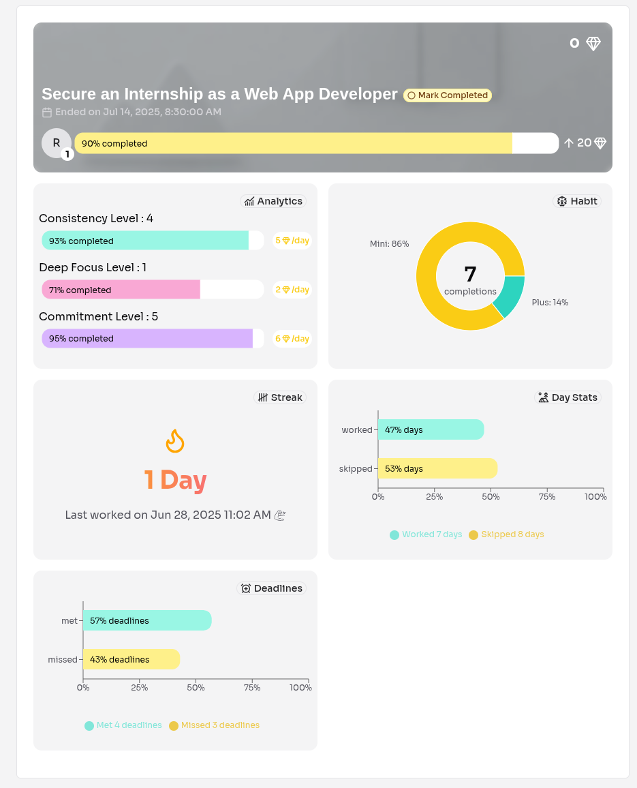
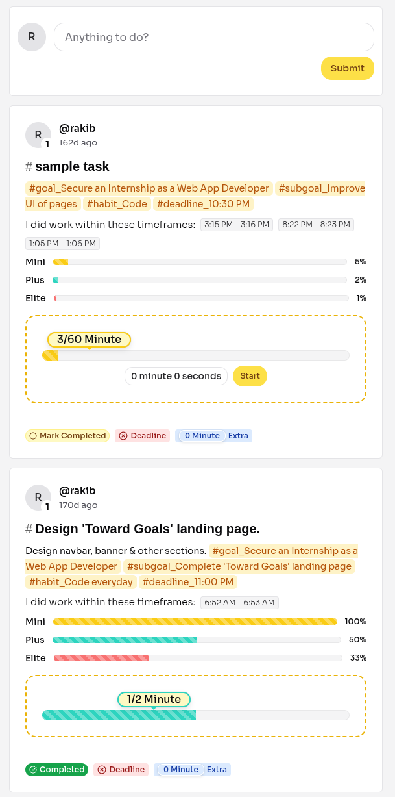

## 🚀 Toward Goals | Plan Bold. Track Smart. Achieve More.

> **Live Demo:** [https://towardgoals.vercel.app](https://towardgoals.vercel.app/)

> **Backend Repo:** [https://github.com/hassanrakib/toward-goals-server](https://github.com/hassanrakib/toward-goals-server)

> **Test Account:** username: rakib | password: rakiB98_

---

## 📖 About The Project

**Toward Goals** is a productivity-focused web application that helps users break long-term goals into actionable subgoals, habits, and daily tasks. It features progress tracking, elastic difficulty levels, and social goal sharing to motivate consistent growth through gamification and accountability.

### 👀 Preview
| Goal Analytics | Tasks |
|:------------:|:---:|
|  |  |

---

## 🛠️ Tech Stack

I chose a modern JavaScript-based stack to build a scalable, maintainable, and feature-rich web application with strong type safety and a smooth user experience.

| Component | Technology |
| :------- | :-------- |
| **Frontend** | TypeScript, Next.js, Chakra UI, Redux |
| **Backend**         | Express.js, Node.js, MongoDB, Mongoose |
| **Other Libraries** | Algolia Search, Tiptap Editor, Recharts, React Hook Form, JWT, Zod, Multer, etc

---

## ✨ Key Features

* **Systematic Goal Achievement:** Platform designed around **Elastic Habits** to promote consistency and adjustability, preventing goal abandonment when life events occur.

* **Hierarchical Goal Structuring:** Supports breaking down large, long-term goals into smaller, manageable **Sub-Goals**, each with adjustable deadlines.

* **Adaptive Habit Tracking:** Users can define habits with **three difficulty levels (Mini, Plus, Elite)**, allowing the daily task commitment to flex based on the user's current capacity or mood.

* **Time Tracking & Task Completion:** Provides a dedicated interface to track time spent on tasks, ensuring the mini difficulty level is completed as a minimum requirement before marking a task as done.

* **Future-Ready Collaboration:** Implemented a scalable search interface allowing users to find and join public goals, laying the groundwork for a social accountability and group tracking environment.

* **Seamless Navigation:** Key navigation pages (creating sub-goals, habits, and tasks) are opened as non-disruptive dialogues/modals, minimizing page reloads and context loss.

---

## 🧠 Engineering Highlights & Challenges

* **Optimized Goal-Task Workflow via Next.js Interceptors:** Leveraged Next.js Route Interceptors and Parallel Routes to manage the complex modal/dialogue structure, enhancing UX while maintaining clean URLs.

* **State Management via URL Search Params:** Utilized Next.js Route Search Parameters for auto-populating creation forms (e.g., pre-selecting the parent Goal when creating a Sub-goal), ensuring state persistence and shareability across component re-renders.

* **Developed Visual Analytics Dashboards:** Built complex data visualizations using Recharts to display critical metrics like streak tracking, performance breakdowns, and three-tier habit completion percentages.

* **High-Performance Search:** Implemented fast, responsive goal search and join functionality using Algolia InstantSearch, preparing the app for collaborative scaling.

* **Hybrid Caching Strategy:** Applied a combined caching approach using Next.js Data Cache and RTK Query mechanisms to deliver highly optimized, fast, and consistent data fetching.

* **Domain-Specific Rich Text Editor:** Integrated Tiptap Rich Text Editor and developed custom extensions to handle dynamic entity mentions (#goal, #subgoal), enabling interactive, contextual task creation.

* **Modular Backend Design:** Engineered a robust RESTful API with Express.js and Mongoose, designing relational-like data models for the complex relationships between Goals, Habits, and Tasks to ensure efficient data handling and system scalability.

